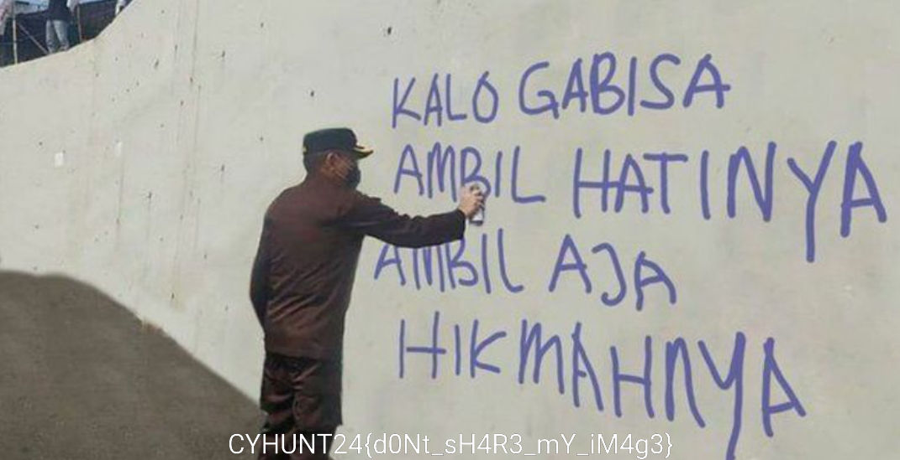

# Description 

mantanku merusak fotoku menjadi pecahan angka aneh ini, bantu aku untuk mendapatkan gambarku kembali

# Solution

Diberi 2 file yatu script python dan txt, mari kita lihat script python nya terlebih dahulu :

```Python
❯ cat solver.py
from Crypto.Util.number import bytes_to_long, long_to_bytes
import string

png = "89 50 4E 47 0D 0A 1A 0A"
png_long = bytes_to_long(bytes.fromhex(''.join(png.split()))[:5])

chip = eval(open('enc', 'r').read())

key = chip[0] ^ png_long
print("Key :", key)

png = b""
for i in chip:
    decrypted = long_to_bytes(i ^ key).rjust(5, b'\0')
    png += decrypted

open('solved.png', 'wb').write(png)
```
Script tersebut mengenkripsi sebuah file 'flag.png' dengan menggunakan operasi XOR antara setiap blok data file tersebut dan sebuah kunci acak 64-bit, kemudian menyimpan hasil enkripsi dalam sebuah file 'enc', sekarang kita lihat isi dari file txt nya :

```
[2648520674601532228, 2648520128230243401, 2648520154155185165, 2648520506288420966, 2648520154101225793, 2648520145511169212, 2648521162111958080, 2648521094182598664, 2648520480921309320, 2648521019291917099, 2648520182515843511, 2648520928975294714, 2648520155452743016, 2648520701103138247, 2648520772657891167, 2648520515758093108, 2648520123322249828, 2648520547240572216, 2648520351666268656, 2648521140678652133, 2648521005989483977, 2648520717265542574, 2648520951164683191, 2648520460426478968, 2648520389727568590, 2648520598895190966, 2648521024651854717, 2648520420992431992, 2648520695456555301, 2648520907631370247, 2648520728918673297, 2648521071667944314, 2648520641367720360, 2648520533346822060, 2648521110923715381, 2648521159132823731]
```
# Summary

Gambar flag di split dijadikan chunk dengan length 5 yang di jadikan long dan dienkripsi pakai XOR yang key nya random. Kami bisa pakai 5 byte pertama dari header png kemudian XOR dengan hasil enkripsi pertama buat dapetin key, setelah itu tinggal deksripsi semua chunk.



# Flag: CYHUNT24{d0Nt_sH4R3_mY_iM4g3}

