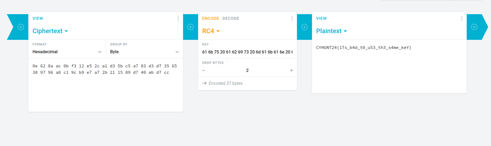

# Description

Perhatikan percakapan mawar dan melati

# Solution 

```
❯ cat chall.txt
mawar   : i have the secret
melati  : i have too
mawar   : what's your secret?
melati  : 61 6b 75 20 61 62 69 73 20 6d 61 6b 61 6e 20 64 65 6e 67 61 6e 20 6b 69 6d 20 6a 6f 6e 67 75 6e
mawar   : wowwww, it's the first time?
melati  : no, its the 2 time?
mawar   : oww niceeee
melati  : btw, can i know your secret?
mawar   : oh yeah of coure, here's my secret "0e 62 8a ac 0b f3 12 e5 2c a1 d3 5b c5 a7 83 d3 d7 35 65 38 97 96 a0 c1 9c b9 e7 a7 2b 21 15 89 d7 40 ab d7 cc"
melati  : hah, what is it?
mawar   : you will know if ypu drop the bytes to be 2
```

Dengan melihat nama soal dapat disimpulkan hint atau soal menggunakan bahasa RC4, Terlihat bahwa ada bilangan desimal, mari kita eksekusi.



Nilai hex yang dimiliki melati di buat untuk KEY dan nilai hex mawar untuk ciphertext terakhir nilai dari drop bytes adalah 2, dan menemukan flagnya

# Flag: CYHUNT24{1Ts_b4d_t0_u53_th3_s4me_keY}
