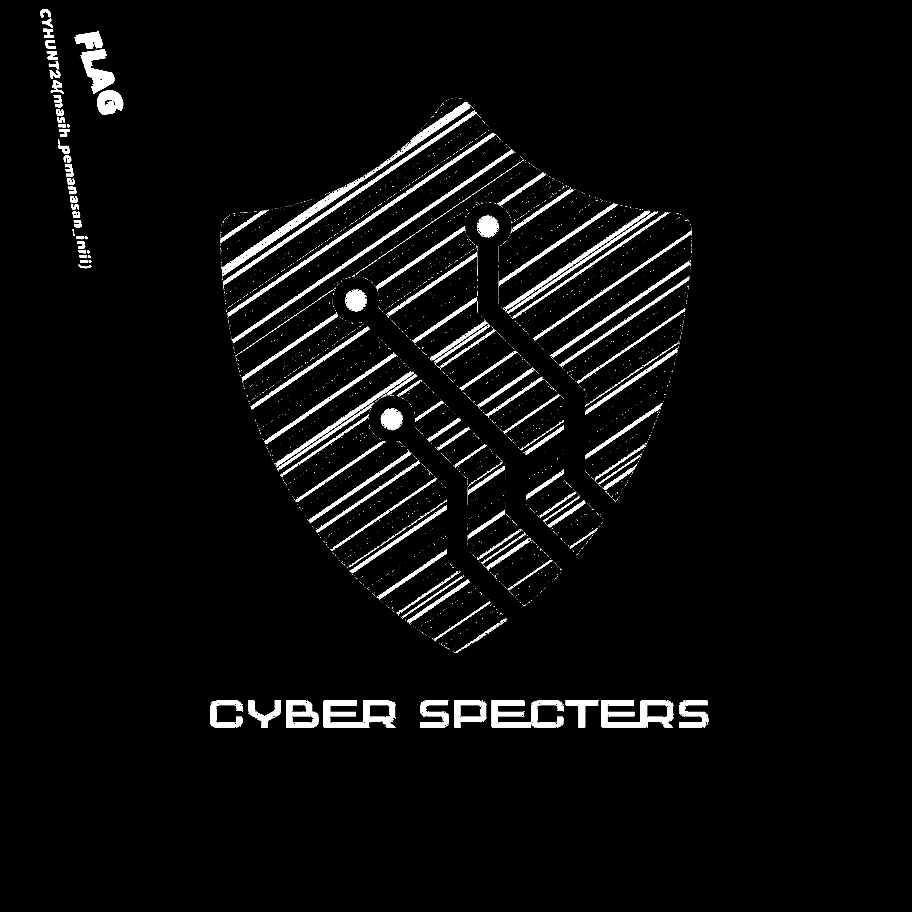

# Description

bantu saya menganalisa gambar ini pleaseeeeeee

# Solution

Disoal IMG yang berkategori ini kita diberikan file gambar yang berformat PNG.
Yang saya lakukan pertama kali adalah mengecek metadatanya/informasi lebih lanjut isi dari file
gambar tersebut
```
❯ exiftool chall.png
ExifTool Version Number : 12.76
File Name : chall.png
Directory : .
File Size : 1943 kB
File Modification Date/Time : 2024:05:31 23:16:39+07:00
File Access Date/Time : 2024:06:01 09:23:06+07:00
File Inode Change Date/Time : 2024:06:01 09:23:00+07:00
File Permissions : -rw-r--r--
File Type : PNG
File Type Extension : png
MIME Type : image/png
Image Width : 5000
Image Height : 5000
Bit Depth : 8
Color Type : RGB with Alpha
Compression : Deflate/Inflate
Filter : Adaptive
Interlace : Noninterlaced
SRGB Rendering : Perceptual
Image Size : 5000x5000
Megapixels : 25.0
❯ file chall.png
chall.png: PNG image data, 5000 x 5000, 8-bit/color RGBA, non-interlaced
❯ binwalk chall.png
DECIMAL HEXADECIMAL DESCRIPTION
--------------------------------------------------------------------------------
0 0x0 PNG image, 5000 x 5000, 8-bit/color RGBA, non-interlaced
54 0x36 Zlib compressed data, compressed
1579903 0x181B7F ESP Image (ESP3252): segment count: 0, flash mode: DIO, flash size:
1MB, entry address: 0x2008020
1636464 0x18F870 ESP Image (ESP3252): segment count: 3, flash mode: DIO, flash size:
1MB, entry address: 0x2008020
```
Tidak ada yang mencurigakan, step selanjutnya adalah saya mencoba melakukan stegsolve agar
bisa melihat isi pesan atau lainnya yang tersembunyi melalui filter warna.
Setelah saya mencoba akhirnya saya berhasil menemukan flagnya 



CYHUNT24{masih_pemanasan_iniii}

# Flag = CYHUNT24{masih_pemanasan_iniii}
